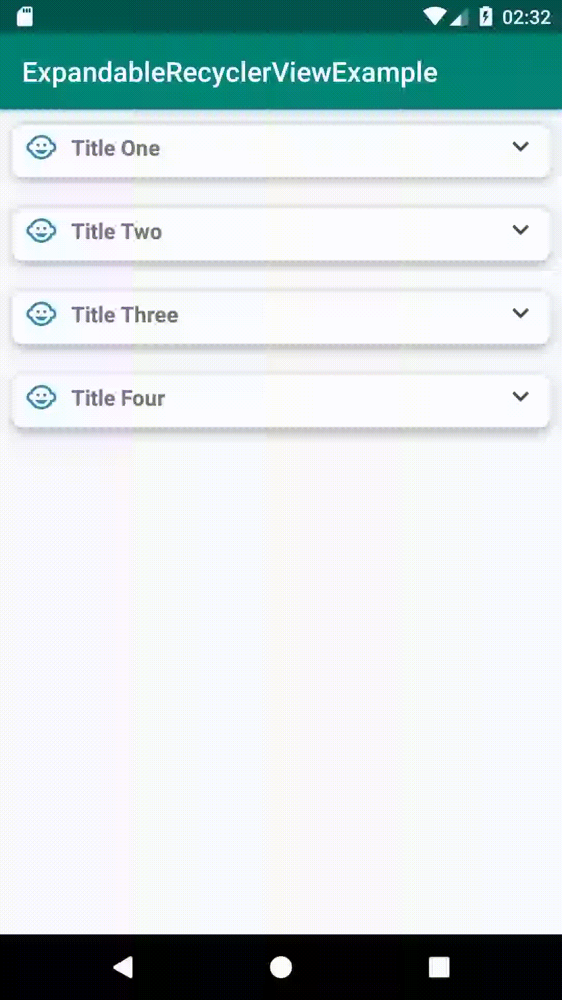

## A simple way to handle a list inside a list with a single one Recycler View and make it expandable

### This is just a example to handle with a situation like you have a list inside another list, then, you can solve it just using a single recyclerview and adapter to populate into a single one card,
so the project doesn't follow any pattern, it's just a hard work code to handle with this particular and tricky situation, you can get this as an example and put in your code.

### Expandable

### Normal

